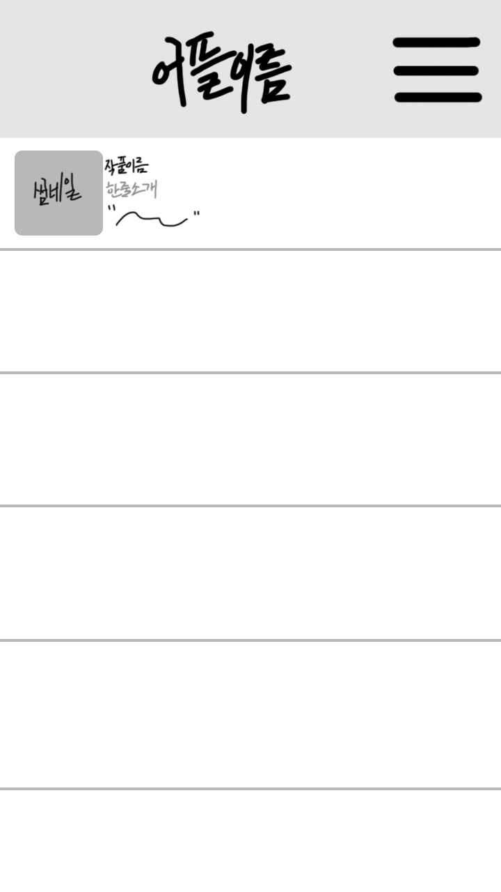

# 캡스톤 디자인

## ▶12주차 과제
 

## ▶11주차 과제
 
 
 
 ## ▶10주차 과제
 
 
 ## ▶9주차 과제
 
 
 ## ▶7주차 과제
 
 
 
 ## ▶4주차 과제(안드로이드 앱 개발)
  ▶ 명대사 및 어록 어플
  - 기획 의도: 평소 힘들 때 힘나는 어록 등을 찾아보는 경우가 많은데 그럴 필요 없이 보았던 영화나 드라마속 기억에 남는 명대사 및 유명인들의 어록들을 기록하고, 공유할 수 있는 어플이 생기면 편리할     것 같
  - 단순 어록 기록용이 아닌 영화나 드라마의 명대사를 게시하며 추천하는 형식으로 기획 예정. 영화나 드라마를 좋아하는 사람들에게도 참신하게 접근 가능할 것 같음.
  
  어플 디자인은 다음과 같은 방식으로 진행할 예정.
  

## ▶3주차 과제

## ▶2주차 과제

